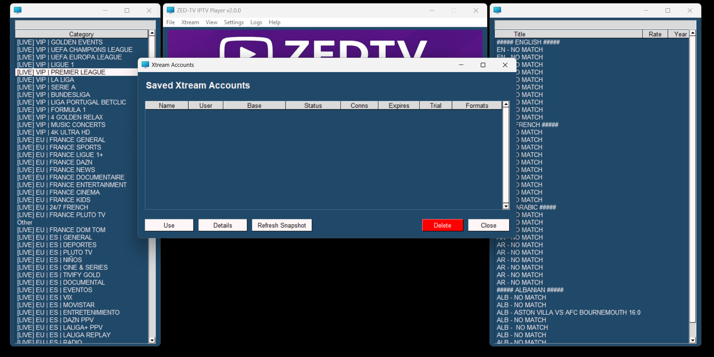
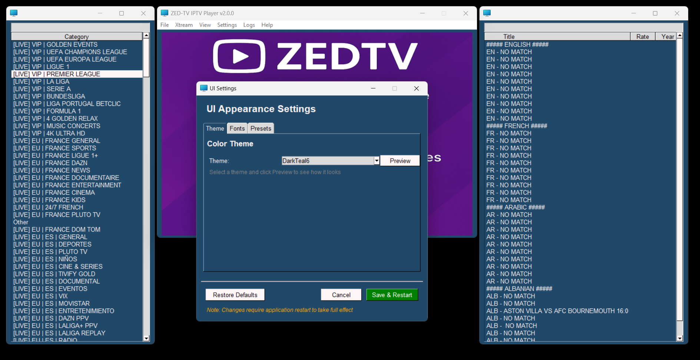
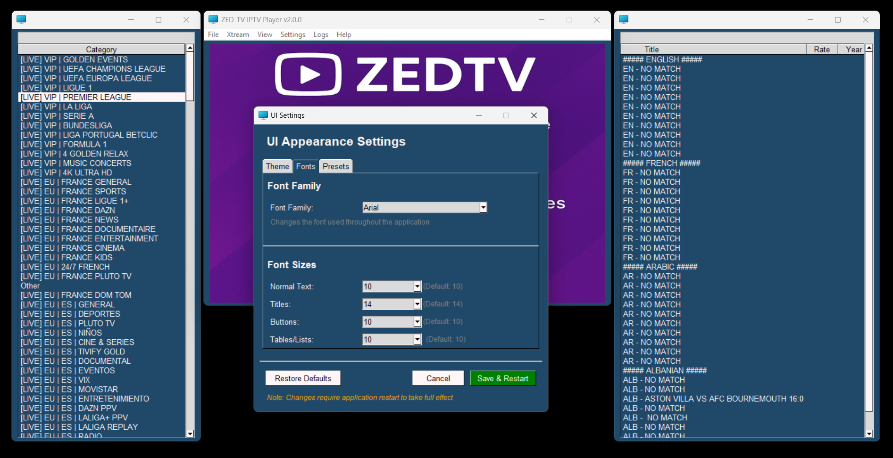
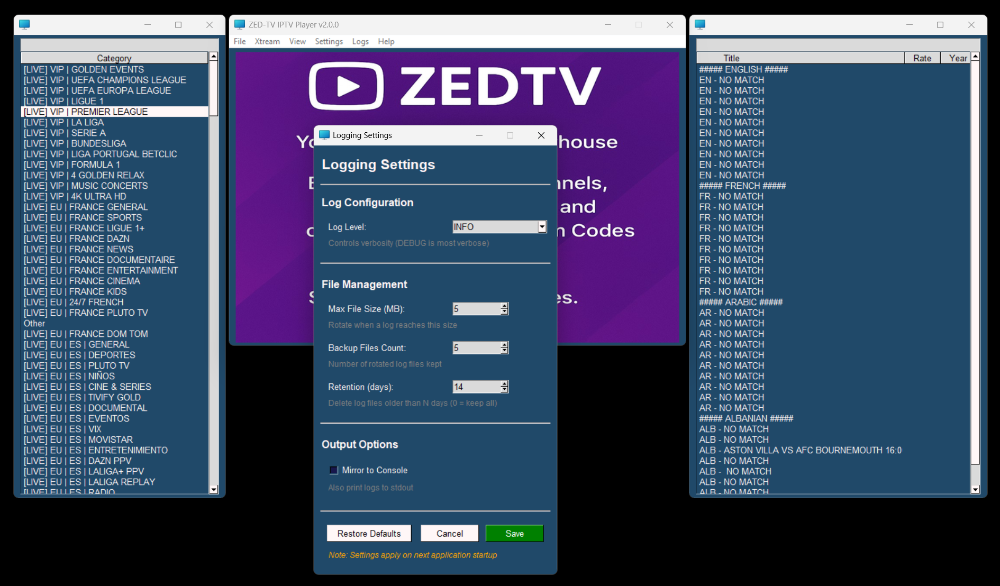
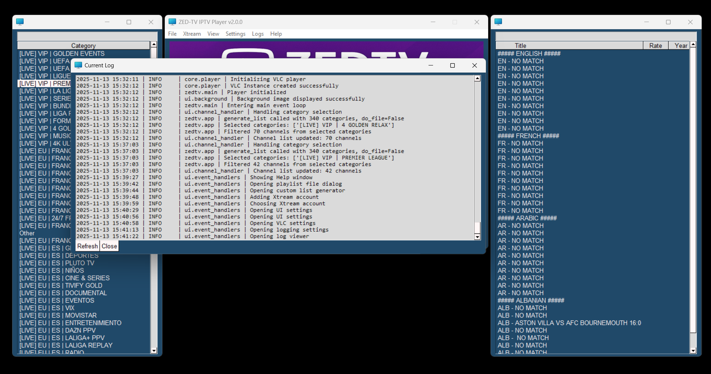
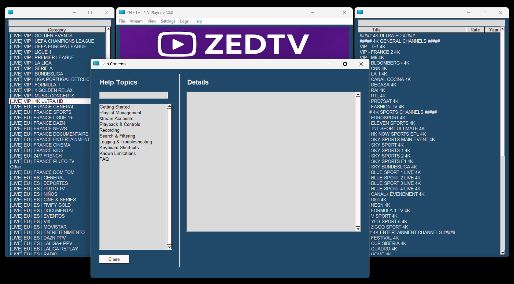

# IPTV Player, Recorder and M3U List Creator
[](https://github.com/r00tmebaby/ZedTV-IPTV-Player-Recorder-Scraper/actions/workflows/ci.yml)
[](https://github.com/r00tmebaby/ZedTV-IPTV-Player-Recorder-Scraper/actions)
[](https://www.python.org/downloads/)
[](LICENSE)











## Overview
ZeDTV is an all-in-one IPTV toolkit: scrape & browse channels, play them, build your own M3U lists, and (new!) connect directly to **Xtream Codes / Xtream UI** portals with account management and offline snapshots. The GUI (PySimpleGUI) keeps things simple while still exposing power features like metadata extraction and one-click playback/recording.

## Platform Support
### ❗ Current Status
This project **supports Windows only**.  
It relies on Windows-specific components such as `ctypes.windll.user32` and `libvlc.dll`.  
Although many parts of the codebase (including the GUI) are technically portable, the media backend currently depends on Windows-only libraries, so macOS and Linux are **not supported** at this time.


## What's New (v1.6)
- **Fullscreen Overlay Controls**
  - New keyboard-friendly control bar with icons in fullscreen
  - ESC reliably exits fullscreen even when buttons have focus
  - Added keyboard shortcuts for subtitles, audio, speed, seeking, pause/play
  - Overlay toggles with `C` and fades out when not needed
- **Improved Window Management**
  - Fullscreen minimize/maximize flow fixed so the entire app minimizes together
  - Control buttons stay disabled until playback actually starts, avoiding stuck states
- **Playback Enhancements**
  - Subtitles menu available directly in fullscreen overlay
  - Video timers reset correctly when starting a new VOD and update live (with playback speed display)
  - Settings persistence fixes (subtitle/audio/speed remembered when toggling fullscreen)
- **Global Search Improvements**
  - Ctrl+F window shows channel metadata and double-click to play
  - Searches entire catalog regardless of selected category

## What's New (v1.5)
- **Global Search (Ctrl+F)**
  - Search across ALL channels and videos instantly (not limited to categories)
  - Case-insensitive, starts-with matching for fast filtering
  - Live results as you type
  - Double-click or press Enter to play directly from search results
  - Shows channel title, category, rating, and year in organized table
  - Access via View menu or Ctrl+F keyboard shortcut

- **Major UI Overhaul**
  - Changed the layout from static to dynamic windows which can be decoupled from the main video canvas (winamp like)
  - Clean, modern tabbed interface for all settings windows
  - Filter categories and channels with instant search boxes
  - New Logs menu with options to view current log and open logs folder
  - Added background image when idle (no playback)
  - Added loading spinner when loading M3U or switching accounts
  - Improved overall user experience and navigation
  - Added helpful tooltips on buttons and inputs
  - Added help menu with links to README, issues, license
  - Consistent design language and polished look & feel
  - Improved usability with logical grouping and better spacing
  - 70+ color themes with live preview
  - Customizable fonts and sizes for all UI elements
  - One-click font size presets (Small/Medium/Large/XL)
  - Better readability with larger fonts throughout
  - Reorganized VLC settings into tabs (Network, Video & Audio, Advanced)
  - Added dedicated logging settings window with clear options
  - IP Info window with working Refresh button
  - Consistent layouts across all settings windows
  - Improved error handling with user-friendly messages
  - Fixed various minor bugs and UI glitches
  - Settings organized into logical groups (no more endless scrolling!)
  - Improved spacing, padding, and button alignment throughout
  - Larger fonts and better readability across the board
  
- **UI Settings** (tabbed)
  - **Theme tab**: 70+ color themes with live preview
  - **Fonts tab**: Customize font family and sizes for all UI elements
  - **Presets tab**: One-click font size presets (Small/Medium/Large/XL)
  
- **VLC Settings** (tabbed)
  - **Network tab**: Buffer settings for smooth streaming
  - **Video & Audio tab**: Hardware acceleration, output options, volume control
  - **Advanced tab**: Performance tweaks and maintenance options
  
- **Logging Settings**
  - Configure log levels, file rotation, retention policies
  - Mirror logs to console for debugging
  - Clean, organized interface with helpful descriptions
  
- **Fixed Features**
  - IP Info now works properly with Refresh button
  - Better error handling with user-friendly messages
  - All settings windows use consistent, polished layouts
  
- **Previous Features (v1.4)**
  - Xtream Codes integration with account management
  - VLC player settings (network buffering, hardware acceleration)
  - Session restore - remembers your last account/M3U
  - Recording to MP4 with live preview
  - Fast startup (1-2 seconds)
  - 113 unit tests ensuring reliability

---

## Features
- **Global Search**
  - Search across entire catalog with Ctrl+F
  - Instant filtering as you type
  - Case-insensitive, starts-with matching
  - Direct playback from search results
  - Shows channel details: title, category, rating, year

- **Modern Tabbed Interface**
  - Settings organized in tabs for easy navigation
  - Professional UI with proper spacing and alignment
  - 70+ themes to choose from with live preview
  - Customizable fonts and sizes across the entire app
  
- **Xtream Codes Support**
  - Add/manage multiple accounts with snapshots
  - Auto-generate enriched M3U playlists
  - View account status, expiry, connection limits
  - Refresh snapshots to update server info
  
- **Smart Player**
  - In-app playback with bundled VLC libraries
  - Configurable buffering and hardware acceleration
  - Record to MP4 while watching
  - Right-click menu for Full Screen/Record/External VLC
  
- **Easy to Use**
  - Auto-restore last session (account or M3U file)
  - Instant search filtering for categories and channels
  - Custom M3U playlist creator
  - Background image when idle

---

## Requirements

### Python
- Python **3.10+** recommended. Fully support **3.13**

### PyPI Libraries
- `PySimpleGUI`
- `requests`
- `httpx`
- `pydantic`

### Standard Library (no install needed)
- `asyncio`, `ctypes`, `json`, `pathlib`, `dataclasses`, etc.

### Bundled / Custom
- `libs/player.py` (media backend wrapper)
- `programs/` (auxiliary logic)

### Optional
- **VLC 3.x** installed & on PATH (for “Play in VLC”)
  - Windows: `C:\Program Files\VideoLAN\VLC\vlc.exe`
  - macOS: uses `open -a VLC`
  - Linux: `vlc` on PATH

> The in-app player uses the included `libs/player`. External “Play in VLC” requires a system VLC install.

---

## Installation

### Option 1: Windows Executable (Recommended)
1. **Download** `ZedTV-IPTV-Player-v1.5.zip` from releases
2. **Extract** all files to a folder
3. **Run** `ZedTV-IPTV-Player.exe`

**Note:** Keep all files together! The .exe needs the `_internal` folder and `libs` folder to work.

**Startup time:** 1-2 seconds (blazing fast!)

### Option 2: Run from Source

1. **Clone the repository**
   ```bash
   git clone https://github.com/r00tmebaby/ZedTV-IPTV-Player-Recorder-Scraper.git
   cd iptv-scraper-player
   ```

2. **Install dependencies**
   ```bash
   pip install -r requirements.txt
   ```
   Minimal `requirements.txt`:
   ```
   PySimpleGUI>=4.60
   requests>=2.31
   httpx>=0.27
   pydantic>=2.0
   ```

3. **Run the application**
   ```bash
   python src/main.py
   ```

---

## Directory Structure
```
data/                    # User data and configuration (gitignored - private)
records/                 # MP4 recordings
xtream_accounts.json     # Saved Xtream accounts (gitignored - private)
src/
  main.py                # App entry point
  libs/
    player.py            # Player backend wrapper
```

**Note:** The `data/` folder and `xtream_accounts.json` contain private information and are excluded from version control.

---

## Usage

### Load from Xtream
- **Xtream → Add Account**  
  Enter host/port/HTTPS, username & password. Click **Test & Save** to validate & stash a snapshot.
- **Xtream → Accounts…**  
  - **Use**: switch to the selected account and auto-build/load the M3U.  
  - **Details**: view saved user/server info.  
  - **Refresh Snapshot**: re-pull API data into the saved snapshot.  
  - **Delete**: remove the account.
- **Xtream → Reload from Current**  
  Rebuilds the M3U and refreshes categories for the current account.

### Load a Local M3U
- **File → Open** and select a `.m3u`. The path is saved for next time.

### Browse & Play
- Select a **Category** (left).  
- Pick a channel/movie (right).  
- Double-click or right-click for **Full Screen / Record / Play in VLC**.  
- **Record** writes MP4 files to the `records/` directory.
- When idle (no playback), the video canvas shows the placeholder `background.jpg`.

### Global Search
- Press **Ctrl+F** or go to **View → Global Search**
- Type to search across ALL channels and videos (not limited to categories)
- Results filter instantly as you type (case-insensitive, starts-with matching)
- Double-click a result or press Enter to play immediately
- Shows title, category, rating, and year for easy identification

### Customize Your Experience
- **Settings → UI Settings**: Choose your theme, customize fonts, apply quick presets
- **Settings → VLC Settings**: Adjust buffering, enable hardware acceleration, tweak performance
- **Settings → Logging Settings**: Configure log levels, rotation, and retention
- **Settings → IP Info**: View your IP address and location (with refresh)
- **Logs → View Current Log**: See real-time application logs
- **Logs → Open Logs Folder**: Access all saved log files

### Create a Custom List
- **File → Custom List** to save the currently selected items into a new M3U.

### Auto-Restore Session
- ZeDTV remembers your **last used account or M3U** and auto-loads it on startup.

---

## Data & Privacy Notes
- Xtream **credentials** and full **API snapshots** are stored **locally** in `xtream_accounts.json` (plain JSON).  
  Keep this file private and out of version control.
- Last session info is stored in `app_settings.json`.

---

## Troubleshooting

- **Auth failed (Xtream)**
  - Check host, port, HTTP vs HTTPS, and credentials (case-sensitive).
  - Ensure your account is **Active** and not expired; try **Details** or **Refresh Snapshot**.

- **“VLC executable not found”**
  - Install VLC or add it to PATH. macOS uses `open -a VLC`.

- **Empty categories**
  - Make sure a valid M3U is open or an Xtream account is in use.
  - Try **Xtream → Reload from Current** after network hiccups.

---

## Development & Building

### Building from Source
This project now uses **Nuitka** instead of PyInstaller for better performance and faster cold start times.

#### Quick Build (Development)
```bash
build_nuitka.bat quick
```
- Fast compilation for development iterations
- No LTO optimization, no progress reporting
- Good for testing changes quickly

#### Release Build (Production)
```bash
build_nuitka.bat release
```
- Full optimization with LTO (Link Time Optimization)
- Progress reporting and build analysis
- Recommended for distribution

#### Standard Build
```bash
build_nuitka.bat
```
- Balanced build with LTO but no progress reporting
- Good for most use cases

#### Complete Build Process
```bash
build_all.bat
```
- Runs tests, builds with Nuitka, creates packages, generates ZIP
- One-command solution for full release preparation

### Build Requirements
- **Python 3.12+** (3.13.5+ or 3.12.x recommended)
- **Microsoft Visual C++ Build Tools** or Visual Studio
- **Nuitka** and dependencies (auto-installed by build scripts)
- Sufficient disk space (Nuitka creates larger intermediate files)

### Build Scripts Overview
- `build_nuitka.bat` - Main Nuitka build script with options
- `build_quick.bat` - Quick development build (uses Nuitka now)
- `build.bat` - Standard build (migrated to Nuitka)
- `build_all.bat` - Complete build + packaging pipeline
- `build_pyinstaller_legacy.bat` - Legacy PyInstaller support (if needed)

### Why Nuitka?
- **Faster cold start**: Compiled Python code loads much quicker than PyInstaller bundles
- **Better performance**: True compilation vs. interpreter bundling
- **Smaller runtime footprint**: More efficient memory usage
- **More reliable**: Less prone to import and dependency issues

### Legacy PyInstaller Support
If you need to use PyInstaller for any reason:
```bash
build_pyinstaller_legacy.bat
```
Note: PyInstaller builds are slower to start and less optimized.

---

## License
This project is licensed under the [MIT License](LICENSE).

---

## Contributing / Issues
Found a bug or have an idea? Open an issue:  
`https://github.com/r00tmebaby/ZedTV-IPTV-Player-Recorder-Scraper`

---

## Disclaimer
This tool is intended for personal use only. You are responsible for how you use it. Respect content rights and local laws.

---

## VLC Libraries in the Build
- We ship and test against a full set of VLC libs/plugins during development.
- For release builds, we bundle only the plugins needed for typical IPTV playback and MP4 recording (access, demux, codec, packetizer, stream_out, mux, audio/video outputs, and d3d11).
- This keeps the package smaller and helps startup stay fast while preserving all current functionality.
- If you need an extra VLC feature (e.g., uncommon protocols), open an issue and we can include that plugin family.
