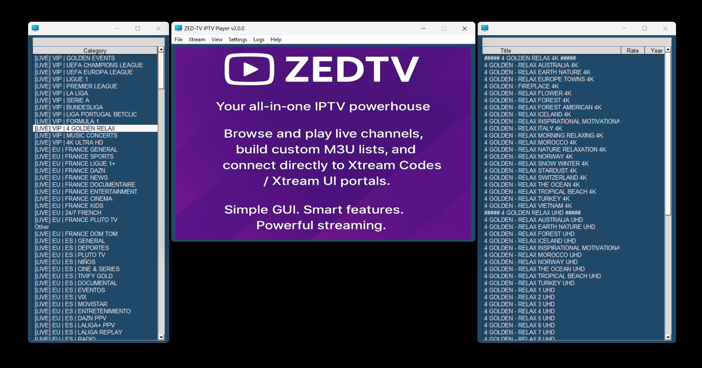
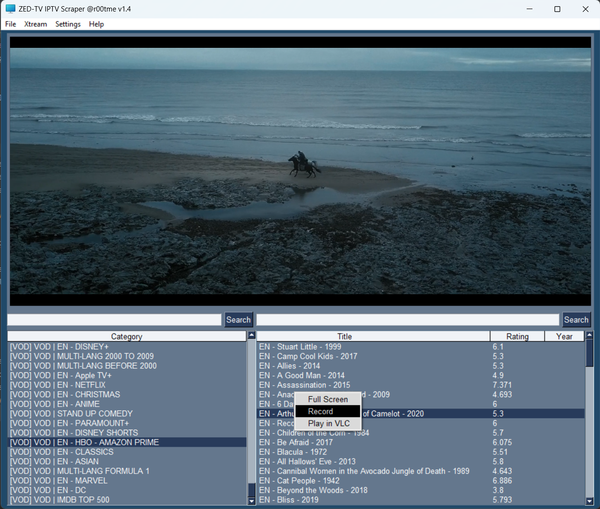
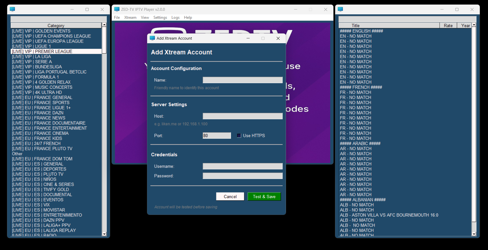

# ZeDTV — IPTV Scraper, Player, Recorder and M3U List Creator




## Overview
ZeDTV is an all-in-one IPTV toolkit: scrape & browse channels, play them, build your own M3U lists, and (new!) connect directly to **Xtream Codes / Xtream UI** portals with account management and offline snapshots. The GUI (PySimpleGUI) keeps things simple while still exposing power features like metadata extraction and one-click playback/recording.

---

## What's New (v1.5)
- **Major UI Overhaul**
  - Clean, modern tabbed interface for all settings windows
  - Settings organized into logical groups (no more endless scrolling!)
  - Professional spacing, padding, and button alignment throughout
  - Reorganized menus - removed ugly separators, added dedicated Logs menu
  - Larger fonts and better readability across the board
  
- **UI Settings** (tabbed)
  - **Theme tab**: 70+ color themes with live preview
  - **Fonts tab**: Customize font family and sizes for all UI elements
  - **Presets tab**: One-click font size presets (Small/Medium/Large/XL)
  
- **VLC Settings** (tabbed)
  - **Network tab**: Buffer settings for smooth streaming
  - **Video & Audio tab**: Hardware acceleration, output options, volume control
  - **Advanced tab**: Performance tweaks and maintenance options
  
- **Logging Settings**
  - Configure log levels, file rotation, retention policies
  - Mirror logs to console for debugging
  - Clean, organized interface with helpful descriptions
  
- **Fixed Features**
  - IP Info now works properly with Refresh button
  - Better error handling with user-friendly messages
  - All settings windows use consistent, polished layouts
  
- **Previous Features (v1.4)**
  - Xtream Codes integration with account management
  - VLC player settings (network buffering, hardware acceleration)
  - Session restore - remembers your last account/M3U
  - Recording to MP4 with live preview
  - Fast startup (1-2 seconds)
  - 113 unit tests ensuring reliability

---

## Features
- **Modern Tabbed Interface**
  - Settings organized in tabs for easy navigation
  - Professional UI with proper spacing and alignment
  - 70+ themes to choose from with live preview
  - Customizable fonts and sizes across the entire app
  
- **Xtream Codes Support**
  - Add/manage multiple accounts with snapshots
  - Auto-generate enriched M3U playlists
  - View account status, expiry, connection limits
  - Refresh snapshots to update server info
  
- **Smart Player**
  - In-app playback with bundled VLC libraries
  - Configurable buffering and hardware acceleration
  - Record to MP4 while watching
  - Right-click menu for Full Screen/Record/External VLC
  
- **Easy to Use**
  - Auto-restore last session (account or M3U file)
  - Instant search filtering for categories and channels
  - Custom M3U playlist creator
  - Background image when idle
  
- **Cross-Platform**
  - Works on Windows, macOS, and Linux
  - Fast startup (1-2 seconds)
  - Comprehensive logging with configurable levels

---

## Requirements

### Python
- Python **3.10+** recommended. Fully support **3.13**

### PyPI Libraries
- `PySimpleGUI`
- `requests`
- `httpx`
- `pydantic`

### Standard Library (no install needed)
- `asyncio`, `ctypes`, `json`, `pathlib`, `dataclasses`, etc.

### Bundled / Custom
- `libs/player.py` (media backend wrapper)
- `programs/` (auxiliary logic)

### Optional
- **VLC 3.x** installed & on PATH (for “Play in VLC”)
  - Windows: `C:\Program Files\VideoLAN\VLC\vlc.exe`
  - macOS: uses `open -a VLC`
  - Linux: `vlc` on PATH

> The in-app player uses the included `libs/player`. External “Play in VLC” requires a system VLC install.

---

## Installation

### Option 1: Windows Executable (Recommended)
1. **Download** `ZedTV-IPTV-Player-v1.5.zip` from releases
2. **Extract** all files to a folder
3. **Run** `ZedTV-IPTV-Player.exe`

**Note:** Keep all files together! The .exe needs the `_internal` folder and `libs` folder to work.

**Startup time:** 1-2 seconds (blazing fast!)

### Option 2: Run from Source

1. **Clone the repository**
   ```bash
   git clone https://github.com/r00tmebaby/ZedTV-IPTV-Player-Recorder-Scraper.git
   cd iptv-scraper-player
   ```

2. **Install dependencies**
   ```bash
   pip install -r requirements.txt
   ```
   Minimal `requirements.txt`:
   ```
   PySimpleGUI>=4.60
   requests>=2.31
   httpx>=0.27
   pydantic>=2.0
   ```

3. **Run the application**
   ```bash
   python src/main.py
   ```

---

## Directory Structure
```
data/                    # User data and configuration (gitignored - private)
records/                 # MP4 recordings
xtream_accounts.json     # Saved Xtream accounts (gitignored - private)
src/
  main.py                # App entry point
  libs/
    player.py            # Player backend wrapper
```

**Note:** The `data/` folder and `xtream_accounts.json` contain private information and are excluded from version control.

---

## Usage

### Load from Xtream
- **Xtream → Add Account**  
  Enter host/port/HTTPS, username & password. Click **Test & Save** to validate & stash a snapshot.
- **Xtream → Accounts…**  
  - **Use**: switch to the selected account and auto-build/load the M3U.  
  - **Details**: view saved user/server info.  
  - **Refresh Snapshot**: re-pull API data into the saved snapshot.  
  - **Delete**: remove the account.
- **Xtream → Reload from Current**  
  Rebuilds the M3U and refreshes categories for the current account.

### Load a Local M3U
- **File → Open** and select a `.m3u`. The path is saved for next time.

### Browse & Play
- Select a **Category** (left).  
- Pick a channel/movie (right).  
- Double-click or right-click for **Full Screen / Record / Play in VLC**.  
- **Record** writes MP4 files to the `records/` directory.
- When idle (no playback), the video canvas shows the placeholder `background.jpg`.

### Customize Your Experience
- **Settings → UI Settings**: Choose your theme, customize fonts, apply quick presets
- **Settings → VLC Settings**: Adjust buffering, enable hardware acceleration, tweak performance
- **Settings → Logging Settings**: Configure log levels, rotation, and retention
- **Settings → IP Info**: View your IP address and location (with refresh)
- **Logs → View Current Log**: See real-time application logs
- **Logs → Open Logs Folder**: Access all saved log files

### Create a Custom List
- **File → Custom List** to save the currently selected items into a new M3U.

### Auto-Restore Session
- ZeDTV remembers your **last used account or M3U** and auto-loads it on startup.

---

## Data & Privacy Notes
- Xtream **credentials** and full **API snapshots** are stored **locally** in `xtream_accounts.json` (plain JSON).  
  Keep this file private and out of version control.
- Last session info is stored in `app_settings.json`.

---

## Troubleshooting

- **Auth failed (Xtream)**
  - Check host, port, HTTP vs HTTPS, and credentials (case-sensitive).
  - Ensure your account is **Active** and not expired; try **Details** or **Refresh Snapshot**.

- **“VLC executable not found”**
  - Install VLC or add it to PATH. macOS uses `open -a VLC`.

- **Empty categories**
  - Make sure a valid M3U is open or an Xtream account is in use.
  - Try **Xtream → Reload from Current** after network hiccups.

---

## License
This project is licensed under the [MIT License](LICENSE).

---

## Contributing / Issues
Found a bug or have an idea? Open an issue:  
`https://github.com/r00tmebaby/ZedTV-IPTV-Player-Recorder-Scraper`

---

## Disclaimer
This tool is intended for personal use only. You are responsible for how you use it. Respect content rights and local laws.
