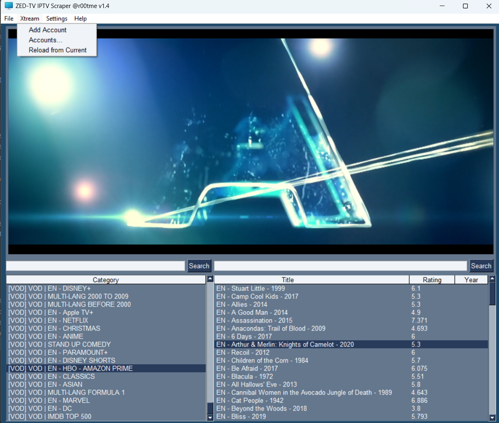
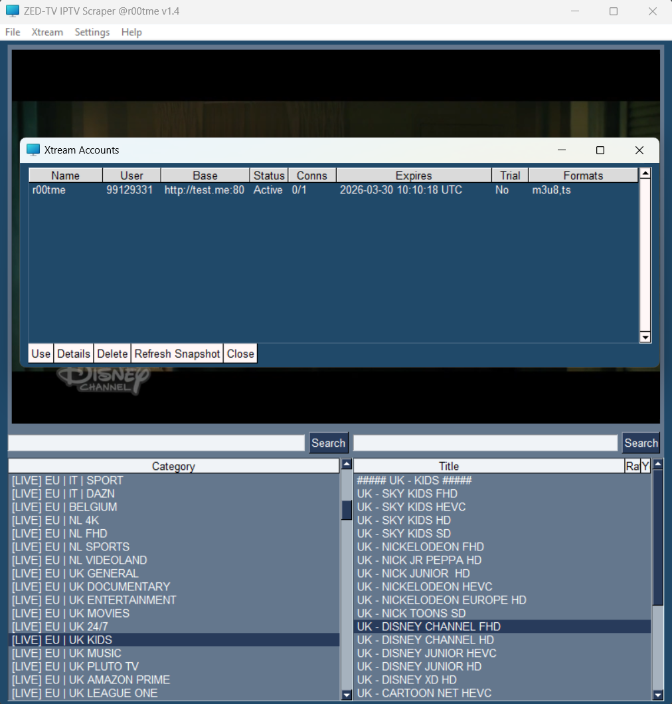

# ZeDTV — Scraper, Player, and M3U List Creator




## Overview
ZeDTV is an all-in-one IPTV toolkit: scrape & browse channels, play them, build your own M3U lists, and (new!) connect directly to **Xtream Codes / Xtream UI** portals with account management and offline snapshots. The GUI (PySimpleGUI) keeps things simple while still exposing power features like metadata extraction and one-click playback/recording.

---

## What’s New (v1.4)
- **Xtream Codes / Xtream UI integration**
  - **Add Account** wizard (test & save credentials).
  - **Accounts…** manager with **Use / Details / Delete / Refresh Snapshot**.
  - Builds **rich M3U** (Live + VOD) with logos, ratings, release year, plots, directors.
  - **Snapshot caching**: full API reply saved locally for instant table rendering without re-hitting the server.
- **Session restore**
  - Remembers and **autoloads your last used account or M3U** on startup.
- **Quality-of-life**
  - Category & channel search.
  - Context menu: **Full Screen / Record / Play in VLC**.
  - Safer filenames for recordings; better Windows path handling.

---

## Features
- **Xtream (Xtream Codes / Xtream UI)**
  - Add/test & save accounts to `xtream_accounts.json`.
  - Accounts table shows **Status, Connections, Expiry, Trial, Formats** (from cached snapshot).
  - **Refresh Snapshot** to re-pull server/user info and update the table.
  - Generates `xtream_<username>.m3u` and an in-memory catalog for enriched channel/movie metadata.
- **Session Memory**
  - Persists last choice (account **or** M3U) in `app_settings.json` and auto-restores it next launch.
- **IPTV Scraper**
  - Retrieve and parse IPTV streams; extract rating/year from EXTINF or the Xtream catalog.
- **Integrated Player**
  - In-app playback via bundled `libs/player`.
  - Right-click a row for **Full Screen**, **Record** (MP4 to `records/`), or **Play in VLC** externally.
- **M3U List Creator**
  - Generate & manage M3U playlist files from selections.
- **Simple GUI**
  - A user-friendly interface built with PySimpleGUI.
- **Cross-Platform Support**
  - Linux, macOS, and Windows.

---

## Requirements

### Python
- Python **3.10+** recommended. Fully support **3.13**

### PyPI Libraries
- `PySimpleGUI`
- `requests`
- `httpx`
- `pydantic`

### Standard Library (no install needed)
- `asyncio`, `ctypes`, `json`, `pathlib`, `dataclasses`, etc.

### Bundled / Custom
- `libs/player.py` (media backend wrapper)
- `programs/` (auxiliary logic)

### Optional
- **VLC 3.x** installed & on PATH (for “Play in VLC”)
  - Windows: `C:\Program Files\VideoLAN\VLC\vlc.exe`
  - macOS: uses `open -a VLC`
  - Linux: `vlc` on PATH

> The in-app player uses the included `libs/player`. External “Play in VLC” requires a system VLC install.

---

## Installation

1. **Clone the repository**
   ```bash
   git clone https://github.com/yourusername/iptv-scraper-player.git
   cd iptv-scraper-player
   ```

2. **Install dependencies**
   ```bash
   pip install -r requirements.txt
   ```
   Minimal `requirements.txt`:
   ```
   PySimpleGUI>=4.60
   requests>=2.31
   httpx>=0.27
   pydantic>=2.0
   ```

3. **Run the application**
   ```bash
   python main.py
   ```

---

## Directory Structure
```
records/                 # MP4 recordings
xtream_accounts.json     # Saved Xtream accounts (+ snapshots)
app_settings.json        # Last used account/M3U for auto-restore
xtream_<username>.m3u    # Generated M3U cache per Xtream account
main.py                  # App entry point
libs/
  player.py              # Player backend wrapper
programs/                # Additional modules
```

---

## Usage

### Load from Xtream
- **Xtream → Add Account**  
  Enter host/port/HTTPS, username & password. Click **Test & Save** to validate & stash a snapshot.
- **Xtream → Accounts…**  
  - **Use**: switch to the selected account and auto-build/load the M3U.  
  - **Details**: view saved user/server info.  
  - **Refresh Snapshot**: re-pull API data into the saved snapshot.  
  - **Delete**: remove the account.
- **Xtream → Reload from Current**  
  Rebuilds the M3U and refreshes categories for the current account.

### Load a Local M3U
- **File → Open** and select a `.m3u`. The path is saved for next time.

### Browse & Play
- Select a **Category** (left).  
- Pick a channel/movie (right).  
- Double-click or right-click for **Full Screen / Record / Play in VLC**.  
- **Record** writes MP4 files to the `records/` directory.

### Create a Custom List
- **File → Custom List** to save the currently selected items into a new M3U.

### Auto-Restore Session
- ZeDTV remembers your **last used account or M3U** and auto-loads it on startup.

---

## Data & Privacy Notes
- Xtream **credentials** and full **API snapshots** are stored **locally** in `xtream_accounts.json` (plain JSON).  
  Keep this file private and out of version control.
- Last session info is stored in `app_settings.json`.

---

## Troubleshooting

- **Auth failed (Xtream)**
  - Check host, port, HTTP vs HTTPS, and credentials (case-sensitive).
  - Ensure your account is **Active** and not expired; try **Details** or **Refresh Snapshot**.

- **“VLC executable not found”**
  - Install VLC or add it to PATH. macOS uses `open -a VLC`.

- **Empty categories**
  - Make sure a valid M3U is open or an Xtream account is in use.
  - Try **Xtream → Reload from Current** after network hiccups.

---

## License
This project is licensed under the [MIT License](LICENSE).

---

## Contributing / Issues
Found a bug or have an idea? Open an issue:  
`https://github.com/yourusername/iptv-scraper-player/issues`

---

## Disclaimer
This tool is intended for personal use only. You are responsible for how you use it. Respect content rights and local laws.
